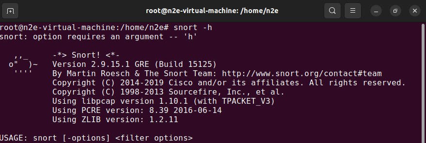
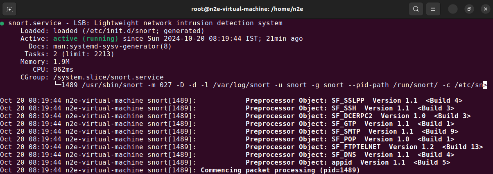
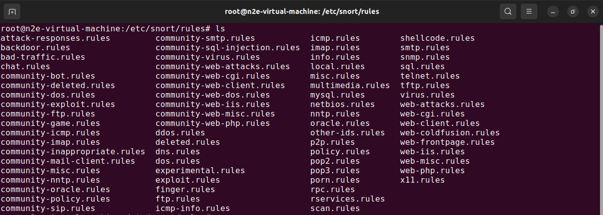
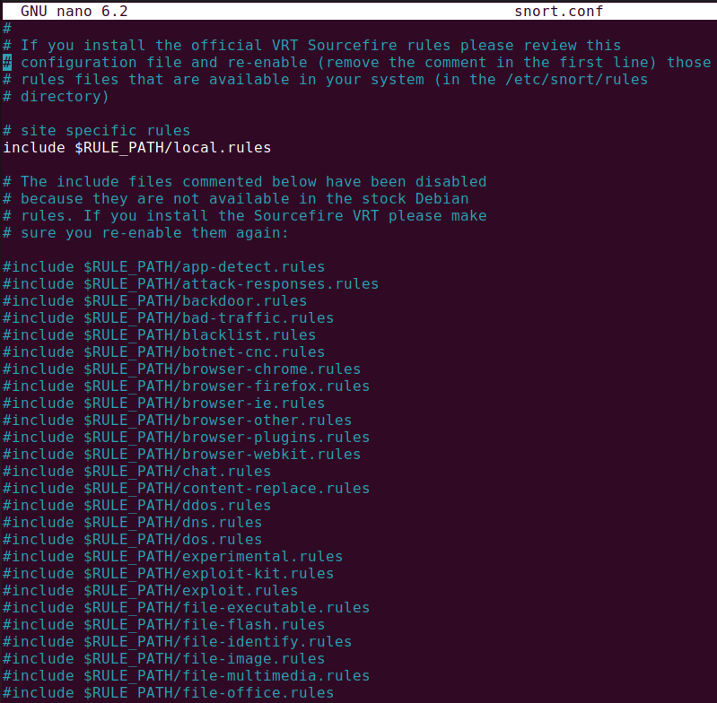
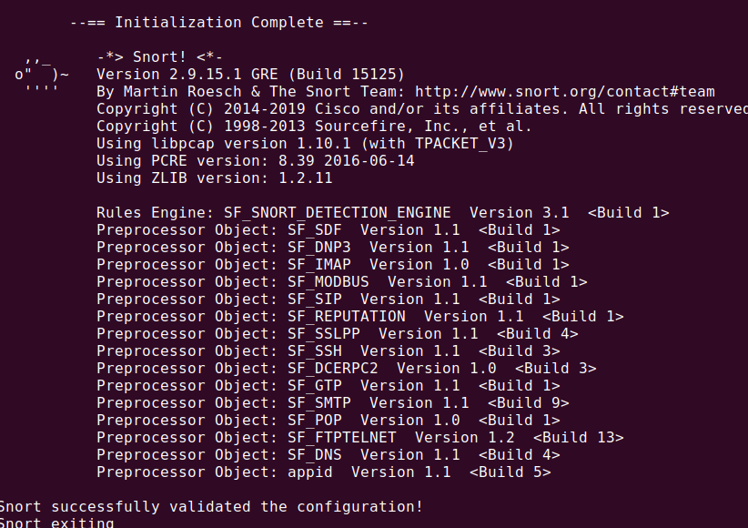
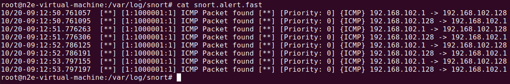

# NIDS using SNORT - Part 1

#### Objectives

- Learn how to install and configure Snort.
- Explore Snort's modes and rule sets.
- Capture and analyze network traffic for intrusion detection.
- Write custom Snort rules for specific attack scenarios.

### Prerequisites

- Wireshark or tcpdump for network traffic analysis (optional)

#### Snort Installation & Configuration

Using your package manager install snort v2, for Debian based distributions (eg. ubuntu) use: `sudo apt install snort`, test if its correctly installed using `snort --version`



- Snort configuration is located at `/etc/snort/snort.conf`
- Snort can work either online and offline
- Online => listening to incoming traffic of a net interface

```bash
sudo snort -A <out_mode> -i <if> -c <config_path> -l <out_path>
```

- Offline => analysis of pcaps

```bash
sudo snort -r <pcap_path> -A <out_mode> -i <if> -c <config_path> -l <out_path>
```

- Also, we can run snort as service

```bash
sudo service snort start
```



#### Snort Default Rules

Snort is a signature-based IDS, and it defines rules to detect the intrusions. All rules of Snort are stored under `/etc/snort/rules` directory. The screenshot below shows the files that contain rules of Snort.



#### Writing your firts Rule

Now, we will write a simple snort rule to alerts on ICMP messages (ping). the following is the rule:

```bash
alert icmp any any -> any any (msg:"ICMP Packet found"; sid:1000001; rev:1;)
```

Bascailly, this rule defines that an alert will be logged if an ICMP packet is found. The ICMP packet could be from any IP address and the rule ID is 1000001. Make sure to pick a SID greater 1000000 for your own rules.

- Put your rule in `/etc/snort/rules/local.rules` and comment all default rules (keep only local-rule file as shown the image bellow)



- Test your configuration with

```bash
sudo snort -T -c /etc/snort/snort.conf
```

The -T option is used to verify the configuration file. it should show sucess message:



- Retsrat you snort service (use `status` command to check snort service after restarting)

```bash
sudo service snort restart
```

#### Triggering an Alert for the New Rule

To trigger an alert for the new rule, you only need to send an ICMP message to the VM image where snort runs. First, you need to find the IP address of the VM (`ipconfig` or `ip a`), then send a ping request (ICMP n 8 message) to the VM IP (`ping <VM_IP>`)

After you send the ping messages, the alerts should be trigged and you can find the log messages in `/var/log/snort/`.



#### Pactices

Try to writing snort rules to detect the following activities

1. HTTP traffic on port 80
2. An FTP connection to the server
3. SYN connection
4. Bad login (530) FTP attempt
5. TELNET connection
6. Email containg credit card information

- Consulate the snort documentation for details on rule options [snort manual](http://manual-snort-org.s3-website-us-east-1.amazonaws.com/)
- Locate pacps in https://github.com/AbdelliNasredine/IT-D , lab2 and inspect the traffic using wireshark to extract signature

#### Offline mode

- Close this repo https://github.com/AbdelliNasredine/IT-D
- Go to lab2 folder and local `scanning.dump` file
- Run snort (offline mode) to analyze the dump file

```bash
sudo snort -r <pcapfile> -c /etc/snort/snort.conf -l ./snort-output
```

#### Take Home Exercise

Generate you own attack traffic and try to detect intrusion attempts using snort

- steps:
  - use tools for execution of attacks/intrusion attempts
    - scanning (`nmap`)
    - exploitation (`metasploit`)
  - capture network traffic: `sudo tcpdump -i <netif> -w /path/to/dumpfile.pcap`
  - run snort (offline mode) on you pcaps
